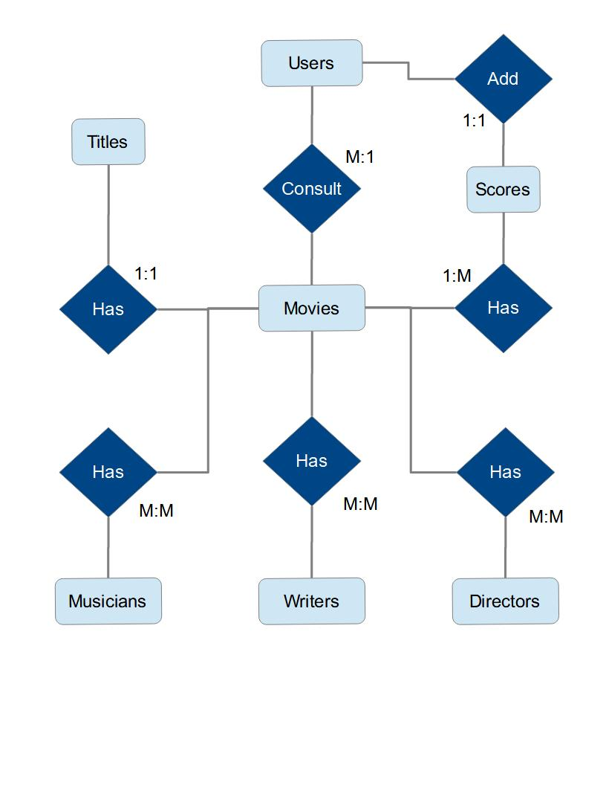
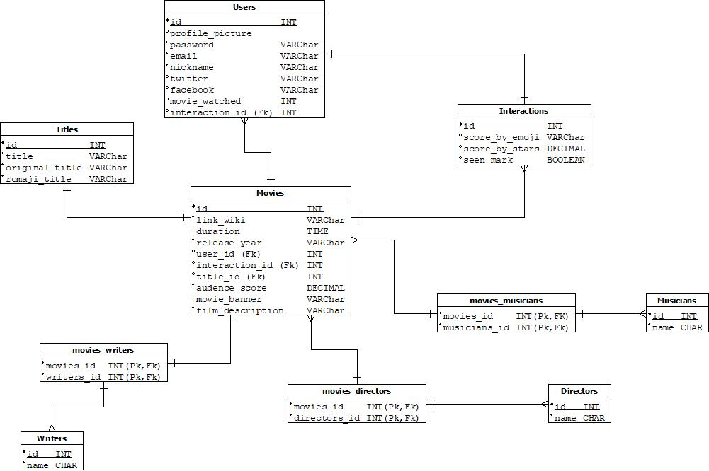

# BE-Studio-Ghibli-Traker
Studio Ghibli Tracker is a web application that allows us to view the catalog of films produced by Studio Ghibli, as well as register a personal rating and keep track of which ones you have already seen and which ones you have not yet.
## Conig-environment
---
The environment is created in Nest.js using Node.js.
## Built With
The next thecnologies were added to build and run this project.

- Node.js
- Nest.js
- PostgreSQL

## Getting Started
---
Would you like to run this amazing app in you local area? So follow the next steps, they are really helpful:
### Prerequisites
In order to execute the project, it is necessary the latest version of npm.

```sh
npm install npm@latest -g
```
## Installation
Perfect! Let's clone the repo, and install the dependencies of the project.

1. Clone the repo
    ```sh
    git clone git@github.com:C10-Ghibli-s/BE-Studio-Ghibli-Tracker.git
    ```
2. Install NPM packages
    ```sh
    npm install 
    ```
3. Install Node 
```sh
# Using Ubuntu
curl -fsSL https://deb.nodesource.com/setup_17.x | sudo -E bash -
sudo apt-get install -y nodejs
```

## Linter Code
ESLint was implemented in this project. To run the lint use the following command.

```sh
npm run lint
```

## The DataBase Modeling
---
We identify seven entities from studio ghibli tracker. They are users, movies, titles, interactions, writers, directors and musicians, only two of them are strong entites which are users and movies; the other ones are weak entities. In the next picture is shown the ER diagram and the relationship that entities have each other.



With this driagram in mind we are able to create the physical diagram with the types of data for each attribute of the entities in the DataBase, in the following image you can see it, also it contains the foreign keys and contraints of the models.



---
 [C10-Squad-Search-Engine]💚 Platzi Master

</br>
</br>
</br>
</br>
</br>
</br>
</br>
</br>
</br>


<p align="center">
  <a href="http://nestjs.com/" target="blank"></a>
</p>

[circleci-image]: https://img.shields.io/circleci/build/github/nestjs/nest/master?token=abc123def456
[circleci-url]: https://circleci.com/gh/nestjs/nest

  <p align="center">A progressive <a href="http://nodejs.org" target="_blank">Node.js</a> framework for building efficient and scalable server-side applications.</p>
    <p align="center">
<a href="https://www.npmjs.com/~nestjscore" target="_blank"></a>
<a href="https://www.npmjs.com/~nestjscore" target="_blank"></a>
<a href="https://www.npmjs.com/~nestjscore" target="_blank"></a>
<a href="https://circleci.com/gh/nestjs/nest" target="_blank"></a>
<a href="https://coveralls.io/github/nestjs/nest?branch=master" target="_blank"></a>
<a href="https://discord.gg/G7Qnnhy" target="_blank"></a>
<a href="https://opencollective.com/nest#backer" target="_blank"></a>
<a href="https://opencollective.com/nest#sponsor" target="_blank"></a>
  <a href="https://paypal.me/kamilmysliwiec" target="_blank"></a>
    <a href="https://opencollective.com/nest#sponsor"  target="_blank"></a>
  <a href="https://twitter.com/nestframework" target="_blank"></a>
</p>
  <!--[](https://opencollective.com/nest#backer)
  [](https://opencollective.com/nest#sponsor)-->

## Description

[Nest](https://github.com/nestjs/nest) framework TypeScript starter repository.

## Installation

```bash
$ npm install
```

## Running the app

```bash
# development
$ npm run start

# watch mode
$ npm run start:dev

# production mode
$ npm run start:prod
```

## Test

```bash
# unit tests
$ npm run test

# e2e tests
$ npm run test:e2e

# test coverage
$ npm run test:cov
```

## Support

Nest is an MIT-licensed open source project. It can grow thanks to the sponsors and support by the amazing backers. If you'd like to join them, please [read more here](https://docs.nestjs.com/support).

## Stay in touch

- Author - [Kamil Myśliwiec](https://kamilmysliwiec.com)
- Website - [https://nestjs.com](https://nestjs.com/)
- Twitter - [@nestframework](https://twitter.com/nestframework)

## License

Nest is [MIT licensed](LICENSE).
