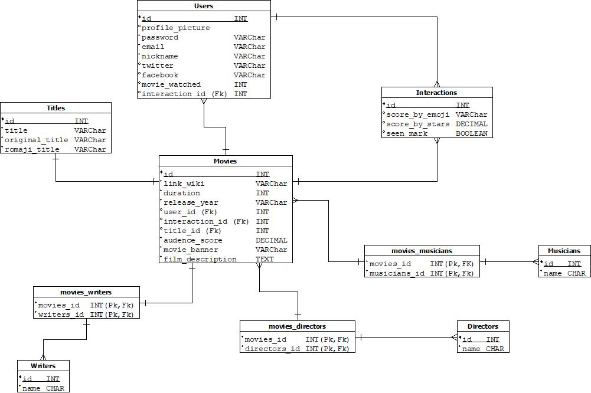

[](https://github.com/LifeSpaceJuan/BE-Studio-Ghibli-Tracker/issues)
[](https://github.com/LifeSpaceJuan/BE-Studio-Ghibli-Tracker/network)
[](https://github.com/LifeSpaceJuan/BE-Studio-Ghibli-Tracker/stargazers)
[](https://github.com/LifeSpaceJuan/BE-Studio-Ghibli-Tracker/blob/main/LICENSE)

[](https://twitter.com/intent/tweet?text=Wow:&url=https%3A%2F%2Fgithub.com%2FLifeSpaceJuan%2FBE-Studio-Ghibli-Tracker)

# BE-Studio-Ghibli-Traker
Studio Ghibli Tracker is a web application that allows us to view the catalog of films produced by Studio Ghibli, as well as register a personal rating and keep track of which ones you have already seen and which ones you have not yet.

This project is done by implemeting the nest JS framework in order to create an API REST capable to respond the resquest from the client side. Resquests like OAuth authentication with username, facebook login, twitter login, create an user, restore his password, change it too; and implement a CRUD for the entities from the Database.

## Config-environment
---
The environment is created in Nest.js using Node.js.
## Built With
The next thecnologies were added to build and run this project.

- Node.js
- Nest.js
- PostgreSQL
- Docker
- Heroku

## Getting Started
---
Would you like to run this amazing app in you local area? So follow the next steps, they are really helpful:
### Prerequisites
In order to execute the project, it is necessary the latest version of npm.

```sh
npm install npm@latest -g
```
## Installation
Perfect! Let's clone the repo, and install the dependencies of the project.

1. Clone the repo
    ```sh
    git clone git@github.com:C10-Ghibli-s/BE-Studio-Ghibli-Tracker.git
    ```
2. Install NPM packages
    ```sh
    npm install 
    ```
3. Install Node 
```sh
# Using a Debian distribution
curl -fsSL https://deb.nodesource.com/setup_17.x | sudo -E bash -
sudo apt-get install -y nodejs
```

## Linter Code
ESLint was implemented in this project. To run the lint use the following command.

```sh
npm run lint
```

## The DataBase Modeling
---
We identify seven entities from studio ghibli tracker. They are users, movies, titles, interactions, writers, directors and musicians, only two of them are strong entites which are users and movies; the other ones are weak entities. In the next picture is shown the ER diagram and the relationship that entities have each other.


With this driagram in mind we are able to create the physical diagram with the types of data for each attribute of the entities in the DataBase, in the following image you can see it, also it contains the foreign keys and contraints of the models.




## Deploy
As a mention in the *built with*, the project is deployed in herku's platform, the Back end side. This is the link to that project:
[Studio-Ghibli Movie Tracker](https://studio-ghibli-c10-platzimaster.herokuapp.com/).

If you want to know more details about the functionality of each point of the API, take a look of this documentation.
[Documentation of the API REST](https://studio-ghibli-c10-platzimaster.herokuapp.com/docs/).

## Our Team!
Without you, this would not be possible...
- [Ivan //AreYouIvan](https://github.com/AreYouIvan)
- [Liliana Restrepo //LilianaRestrepoTorres](https://github.com/LilianaRestrepoTorres)
- [Guillermo //Hai5eDFM](https://github.com/Hai5edfm)

---
 [C10-Squad-Search-Engine]💚 Platzi Master
